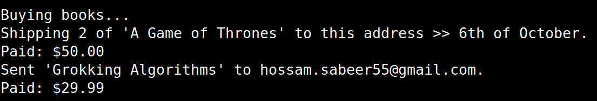
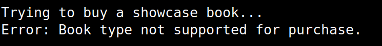
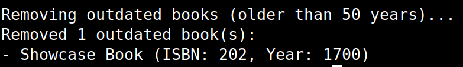

# QuantumBookstore

A simple C# console application demonstrating a bookstore management system. This project showcases Object-Oriented Programming (OOP) principles like abstraction and inheritance to manage different types of books (PaperBook, EBook, ShowcaseBook).

## Prerequisites

- .NET 9.0 SDK or a later version.

## How to Run

You can run this project easily from your terminal using the .NET CLI.

### Clone the repo

```bash
git clone https://github.com/HossamSaberX/FawryQuantumBookstore
cd QuantumBookstore
```
### Run the Project
This command will build and run the application.

```bash
dotnet run
```

## Expected Output

The program executes a test suite that performs several actions: buying books, handling invalid purchase attempts, and cleaning up outdated inventory.

### 1. Successful Book Purchases

The first part of the output shows the successful purchase of a PaperBook and an EBook, including the corresponding shipping/mailing actions and the total price paid.

```csharp
double paid = bookstore.BuyBook("123", 2, "hossam.sabeer55@gmail.com", "6th of October");
Console.WriteLine($"Paid: {paid:C}");

paid = bookstore.BuyBook("789", 1, "hossam.sabeer55@gmail.com", "6th of October");
Console.WriteLine($"Paid: {paid:C}");
```



### 2. Handling Unsupported Book Types

Next, the test attempts to buy a ShowcaseBook, which is not for sale. The program correctly throws and catches an exception, displaying an error message.

```csharp
try
{
    bookstore.BuyBook("202", 1, "hossam.sabeer55@gmail.com", "6th of October");
}
catch (Exception e)
{
    Console.WriteLine($"Error: {e.Message}");
}
```



### 3. Removing Outdated Books

Finally, the program identifies and removes books older than 50 years from the bookstore's inventory and lists the titles that were removed.

```csharp
var removedBooks = bookstore.RemoveOutdatedBooks(50);
if (removedBooks.Count > 0)
{
    Console.WriteLine($"Removed {removedBooks.Count} outdated book(s):");
    foreach (var book in removedBooks)
    {
        Console.WriteLine($"- {book.Title} (ISBN: {book.ISBN}, Year: {book.Year})");
    }
}
else Console.WriteLine("No outdated books to remove.");
```

